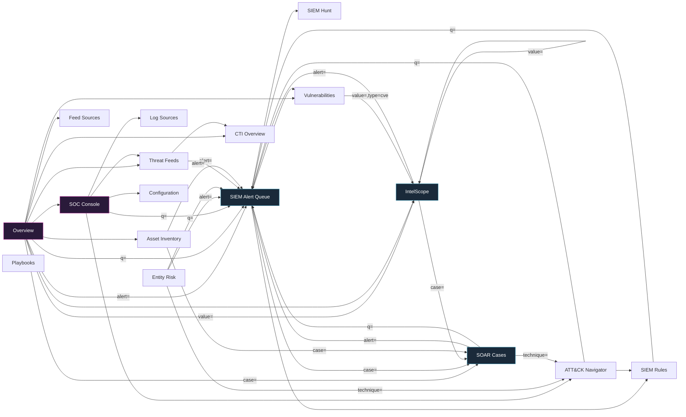

# ThreatOrbit — Dashboard Network Map

> **Purpose.** A complete, ground-truth map of the ThreatOrbit dashboard: every
> page, every feature, every interactive control, every data source, and every
> connection between them — with an honest **status** for each. This is the
> reference we fix against. It is built by reading the source, not by guessing.
>
> If a control is here, it is because it exists in the code. If it is marked
> broken, a line/file reference says where. If a feature *should* exist but
> doesn't, it is listed under **Gaps**.

**Last built from commit:** `574b240` (session baseline). Update the per-page
"verified" line when a section is re-checked against newer code.

---

## How to read this

Each page is documented with a fixed template so nothing is skipped:

- **Route / file / nav** — the URL, the source file, where it sits in navigation.
- **Purpose** — one line: what an analyst uses it for.
- **Data sources** — the exact backend endpoints it reads/writes (via `frontend/lib/api.ts`).
- **Layout & features** — every visible section, in render order.
- **Controls & actions** — *every* button, link, toggle, input, drag target, and
  what it does + where it goes. This is the "tiniest detail" layer.
- **Connections** — deep-links **in** (who sends context here) and **out** (where
  this page sends the analyst), plus external references.
- **Status** — per control, using the legend below.
- **Gaps / bugs** — anything dead, fabricated, frozen, or missing-but-expected.

### Status legend

| Symbol | Meaning |
|---|---|
| ✅ | **Real & wired** — backed by a live endpoint or a working navigation; verified. |
| 🟢 | **Real, static-by-design** — hardcoded but legitimately so (reference data, e.g. MITRE tactic names, CVE seed catalogue). Not a bug. |
| ⚠️ | **Partial / suspect** — works but has a caveat (optimistic-only, demo fallback shown too readily, label mismatch), or not yet re-verified. |
| ❌ | **Dead / fabricated** — button with no handler, control that persists nothing, or hardcoded data shown as if live. **These are bugs.** |
| 🚫 | **Missing** — a feature the nav/product implies should exist here but doesn't. |

### Data-honesty contract (applies everywhere)

1. `frontend/lib/api.ts` `api()` wraps every call and runs `toCamel()` — backend
   returns `snake_case`, the UI reads `camelCase`. (This bit us before: a field
   that isn't transformed reads `undefined` and silently renders blank.)
2. Live data is authoritative **even when empty** — an empty deployment must show
   an honest empty state, never a demo array. Demo/seed constants are labelled
   "offline-only fallback" and should render **only** when the API is unreachable.
3. Any place that shows seed/demo data *as if* it were live is a ❌ (fabrication),
   which is the specific class of bug this project keeps hunting.

---

## 0. Global architecture

### 0.1 Route table (27 routes)

| # | Route | File | Nav location | Feature-gate id |
|---|---|---|---|---|
| 1 | `/dashboard` | `app/dashboard/page.tsx` | (top) Overview | `overview` |
| 2 | `/dashboard/soc` | `app/dashboard/soc/page.tsx` | (top) SOC Console | `soc` |
| 3 | `/dashboard/feeds` | `app/dashboard/feeds/page.tsx` | Intelligence › Threat Feeds › Live Feed | `feeds` |
| 4 | `/dashboard/feeds/sources` | `.../feeds/sources/page.tsx` | Intelligence › Threat Feeds › Sources | `feeds` |
| 5 | `/dashboard/feeds/import` | `.../feeds/import/page.tsx` | Intelligence › Threat Feeds › Import IOCs | `feeds` |
| 6 | `/dashboard/scanner` | `.../scanner/page.tsx` | Intelligence › IntelScope | `scanner` |
| 7 | `/dashboard/cti` | `.../cti/page.tsx` | Intelligence › CTI › Overview | `cti.overview` |
| 8 | `/dashboard/cti/hunt` | `.../cti/hunt/page.tsx` | Intelligence › CTI › Threat Hunt | `cti.hunt` |
| 9 | `/dashboard/cti/actors` | `.../cti/actors/page.tsx` | Intelligence › CTI › Actor Profiles | `cti.actors` |
| 10 | `/dashboard/darkweb` | `.../darkweb/page.tsx` | Intelligence › Dark Web | `darkweb` |
| 11 | `/dashboard/assets` | `.../assets/page.tsx` | Operations › Asset Surface › Inventory | `assets.inventory` |
| 12 | `/dashboard/assets/vulns` | `.../assets/vulns/page.tsx` | Operations › Asset Surface › Vulnerabilities | `assets.vulns` |
| 13 | `/dashboard/assets/network` | `.../assets/network/page.tsx` | Operations › Asset Surface › Network Map | `assets.network` |
| 14 | `/dashboard/siem` | `.../siem/page.tsx` | Operations › SIEM › Alert Queue | `siem.alerts` |
| 15 | `/dashboard/siem/rules` | `.../siem/rules/page.tsx` | Operations › SIEM › Rules Engine | `siem.rules` |
| 16 | `/dashboard/siem/attack` | `.../siem/attack/page.tsx` | Operations › SIEM › ATT&CK Navigator | `siem.attack` |
| 17 | `/dashboard/siem/entities` | `.../siem/entities/page.tsx` | Operations › SIEM › Entity Risk | `siem.entities` |
| 18 | `/dashboard/siem/sources` | `.../siem/sources/page.tsx` | Operations › SIEM › Log Sources | `siem.sources` |
| 19 | `/dashboard/siem/hunt` | `.../siem/hunt/page.tsx` | Operations › SIEM › Threat Hunt | `siem.hunt` |
| 20 | `/dashboard/soar` | `.../soar/page.tsx` | Operations › SOAR › Cases | `soar.cases` |
| 21 | `/dashboard/soar/playbooks` | `.../soar/playbooks/page.tsx` | Operations › SOAR › Playbooks | `soar.playbooks` |
| 22 | `/dashboard/soar/integrations` | `.../soar/integrations/page.tsx` | Operations › SOAR › Integrations | `soar.integrations` |
| 23 | `/dashboard/soar/metrics` | `.../soar/metrics/page.tsx` | Operations › SOAR › SOC Metrics | `soar.metrics` |
| 24 | `/dashboard/config` | `.../config/page.tsx` | System › Configuration › General | `config` |
| 25 | `/dashboard/config/sources` | `.../config/sources/page.tsx` | System › Configuration › Data Sources | `connectors` |
| 26 | `/dashboard/config/users` | `.../config/users/page.tsx` | System › Configuration › Users & Roles | `config` |
| 27 | `/dashboard/config/api` | `.../config/api/page.tsx` | System › Configuration › API Keys | `config` |

### 0.2 Persistent chrome (present on every route)

Mounted by `app/dashboard/layout.tsx`:

- **Sidebar** (`components/dashboard/Sidebar.tsx`) — the nav tree above. Collapses
  to an icon rail; hover/pin to expand. **Live alert badge** at the bottom shows
  `new + investigating` alert count from `fetchSiemAlerts` → links to `/dashboard/siem`. ✅
  Simple-mode hides items not in the org's feature set (`useOrgFeatures`), fail-open. ✅
- **TopBar** (`components/dashboard/TopBar.tsx`) — search trigger, mode toggle,
  user menu. *(section to be detailed)*
- **CommandPalette** (`components/dashboard/CommandPalette.tsx`) — ⌘K global search/nav. *(to be detailed)*
- **AssistantWidget** (`components/dashboard/AssistantWidget.tsx`) — AI assistant. *(to be detailed)*
- **DetailDrawer** (`components/dashboard/DetailDrawer.tsx`) — global right-hand
  detail overlay opened by `openDetail({...})` from any page. Renders rows, tags,
  body, and **actions** (internal `<Link>` or, since this session, external
  `<a target=_blank>` when `external:true`). ✅

### 0.3 Shared feature components (reused across pages)

| Component | Used by | What it is | Status |
|---|---|---|---|
| `ConnectorsPanel` | feeds/sources | Real TI connector CRUD: add/sync/pause/**edit**/delete, honest status | ✅ |
| `PlaybookRunsPanel` | soar/playbooks | Live run history + per-step audit + **approve/reject** | ✅ |
| `IngestionEnginePanel` | feeds/sources | Live engine tick status | ✅ (to verify) |
| `PlaybookBuilder` | soar/playbooks | Visual step builder (create/edit/revert) | ✅ (to verify) |
| `RuleEditor` | siem/rules | Create/edit detection rule + test | ✅ (to verify) |
| `SuppressionsPanel` | siem/rules | Manage suppressions | ✅ (to verify) |
| `EventSearchPanel` | siem/hunt | Raw event search | ✅ (to verify) |
| `LogCollectorPanel` / `LogAnalysisPanel` | siem/sources | Collector config / log analysis | ⚠️ (to verify) |
| `AttackSurfacePanel` | assets | Attack-surface summary | ⚠️ (to verify) |
| `EntityGraph` | cti | Relationship graph | ⚠️ (to verify) |
| `IntelReportsPanel` / `IocLifecyclePanel` | cti | Intel reports / IOC lifecycle | ⚠️ (to verify) |
| `WorldMap` | overview | Live threat geo map | ✅ (to verify) |
| `CreateModal` | feeds/sources, cti, siem/sources, soar/integrations, config/sources | Generic create form | ✅ |
| `ReportButton` | overview, siem, soar, cti, darkweb, assets | Export/report | ⚠️ (to verify) |
| `SavedViewsButton` | siem, feeds, darkweb, assets | Save/restore filters | ⚠️ (to verify) |
| `SigmaImportButton` / `StarterPackButton` | siem/rules | Sigma import / starter rules | ✅ (to verify) |
| `ReportButton`, `AnimatedNumber`, `Skeleton` | many | Presentational helpers | 🟢 |

### 0.4 Connection graph (page-to-page deep-links)

Solid arrow = a control on the source page navigates to the target **with context**
(a `?param=` deep-link). This is the "every action lands on the specific record"
contract.

External references (open in new tab): NVD (`nvd.nist.gov/vuln/detail/<cve>`) from
vulns + feeds; MITRE ATT&CK (`attack.mitre.org`) from ATT&CK Navigator, CTI, cti/hunt.

---

## 1. Overview  ·  `/dashboard`

**File:** `app/dashboard/page.tsx` · **Nav:** top-level · **Verified:** this session (#84).

**Purpose.** The SOC's front door: live KPIs, threat geography, recent alerts/incidents,
top actors, attack vectors, and jump-off tiles to every module.

**Data sources.** `fetchKpis`, `fetchSiemKpis`, `fetchSiemTrends`, `fetchSoarMetrics`,
`fetchRecentAlerts`, `fetchRecentIncidents`, `fetchTopActors`, `fetchVectors`,
`fetchHeatmap`, `fetchHourly`, `fetchRiskDistribution`, `fetchServicesStatus`,
`fetchLiveFeed`, `fetchFleetVulnFindings`. All live.

**Layout & features (render order).**
1. KPI row — live alert/incident/case counters (`fetchKpis`/`fetchSiemKpis`). ✅
2. `WorldMap` — geo threat plot from live feed. ✅
3. Recent alerts list → each row deep-links `/dashboard/siem?alert=<id>`. ✅
4. Recent incidents → `/dashboard/soar?case=<id>`. ✅
5. Top actors, attack vectors, risk distribution, hourly/heatmap charts. ✅
6. Services/health status (`fetchServicesStatus`). ✅
7. Module jump tiles → feeds, cti, vulns, scanner, soc, asset, feed-sources. ✅

**Connections.**
- **Out:** `siem?alert=`, `soar?case=`, `siem?q=`, `scanner?value=`, plus plain
  links to feeds/cti/vulns/scanner/soc/assets/feed-sources.
- **In:** the default landing after login; sidebar "Overview".

**Status.** Card KPIs and every tile navigate to real records (fixed in #84). ✅

**Gaps / bugs.** None open. (Historically had fabricated KPIs; corrected.)

---

## 2. SOC Console  ·  `/dashboard/soc`

**File:** `app/dashboard/soc/page.tsx` · **Nav:** top-level · **Verified:** this session (#87).

**Purpose.** A single triage pane: what needs attention right now (triage queue,
engine health, feed freshness, coverage) with one-click pivots.

**Data sources.** `fetchTriage`, `fetchSiemKpis`, `fetchEngineStatus`,
`fetchFeedsSummary`, `fetchLogListeners`, `fetchAttackCoverage`. All live.

**Layout & features.**
1. Triage queue (`fetchTriage`) — prioritised alerts needing action. ✅
2. Engine status / log listeners (`fetchEngineStatus`, `fetchLogListeners`). ✅
3. Feed freshness (`fetchFeedsSummary`). ✅
4. ATT&CK coverage summary (`fetchAttackCoverage`). ✅

**Connections.**
- **Out:** `siem?q=`, plus links to `siem/attack`, `siem/sources`, `feeds`, `config`, `siem`.
- **In:** sidebar "SOC Console"; overview tile.

**Status.** Populated from live posture (verified #87). ✅

**Gaps / bugs.** None open.

---

## 3. Threat Feeds — Live Feed  ·  `/dashboard/feeds`

**File:** `app/dashboard/feeds/page.tsx` · **Nav:** Intelligence › Threat Feeds › Live Feed.

**Purpose.** The rolling stream of incoming threat-intel events (IOCs, CVEs,
campaigns) as they arrive from connectors.

**Data sources.** `fetchFeeds`, `fetchFeedsSummary`, `fetchIocs`, `importIocs`,
`createAlert`. Live. **Note:** the page also carries a hardcoded demo array of
threat cards (`c001…`, CVE-2024-6387 etc.) — needs confirming these are
fallback-only and not shown alongside live data.  ⚠️ *(verify)*

**Controls & actions.**
- CVE badge on each card → **`https://nvd.nist.gov/vuln/detail/<cve>`** (new tab). ✅ (fixed #90)
- Card → opens detail; IOCs pivot to `/dashboard/siem?alert=` and `/dashboard/cti`. ✅
- Import / create-alert actions. ✅ *(verify wiring)*
- `SavedViewsButton`, `AnimatedNumber`, `Skeleton`. ⚠️/🟢

**Connections.** Out: `siem?alert=`, `cti`, NVD, `attack.mitre.org`. In: overview tile.

**Status.** CVE→NVD links fixed this session. Core stream is live.

**Gaps / bugs.**
- ⚠️ **Confirm** the hardcoded threat-card array (`c001…`) is an offline fallback
  only, never rendered beside live feed data. If it renders in demo/live, it is a
  fabrication ❌. *(open — needs a read of the render branch)*

---

## 4. Threat Feeds — Sources  ·  `/dashboard/feeds/sources`

**File:** `app/dashboard/feeds/sources/page.tsx` · **Verified:** this session (#89).

**Purpose.** Manage upstream feed providers + the real connector control surface.

**Data sources.** `fetchFeeds`, `fetchFeedsSummary`, `createFeed`, `toggleFeed`.
Embeds **`ConnectorsPanel`** (real connector CRUD) + **`IngestionEnginePanel`**.

**Controls & actions.**
- KPI strip: Active Feeds, IOCs Today (real `newToday`), Total Indicators, Errored. ✅
- `ConnectorsPanel`: Add / Sync now / Pause / **Edit-reconfigure** / Delete, honest
  live status + last-error. ✅ (edit added #89)
- Feed table: enable/disable toggle per row (`toggleFeed`). ✅
- Feed **detail panel**: real fields (provider, live status, indicators, interval,
  last pull) + working enable/disable; note that pulls/keys live on the connector. ✅
  (Removed the old dead Configure/Pull-Now/Test-Connection buttons + fake confidence
  slider + invented API-key/TAXII/tag rows this session — #89.)
- Add Feed modal (`CreateModal` → `createFeed`). ✅

**Connections.** In: overview, feeds. Out: (points to ConnectorsPanel above for pulls).

**Status.** ✅ across the board after #89.

**Gaps / bugs.** None open. (Backend feed PATCH only toggles enabled — reconfigure
is a connector concern, and the UI now says so honestly.)

---

## 5. Threat Feeds — Import IOCs  ·  `/dashboard/feeds/import`

**File:** `app/dashboard/feeds/import/page.tsx`.

**Purpose.** Bulk-import indicators (paste / file / format-mapped) into the CTI store.

**Data sources.** `importIocs`, `fetchImportHistory`. Live.

**Controls & actions.** *(to be detailed — read pending)* import form, format
select, submit → `importIocs`; import-history table from `fetchImportHistory`.

**Status.** ⚠️ Not yet re-verified this pass.

**Gaps / bugs.** *(pending read)*

---

## 6. IntelScope (Scanner)  ·  `/dashboard/scanner`

**File:** `app/dashboard/scanner/page.tsx` · **Verified:** this session (#80/#85/#86).

**Purpose.** Look up any indicator (IP/URL/hash/file, and CVE via hand-off) against
the live TI store + enrichment providers + relations, with honest provenance.

**Data sources.** `lookupIoc` (`/cti/lookup`), `fetchScanEnrich` (`/cti/scan/enrich`),
`fetchScanContext` (`/cti/scan/context`), `fetchEnrichers`, `fetchScans`, `recordScan`,
`importIocs`. Live. Degrades to a clearly-labelled demo block only when the API is
unreachable.

**Controls & actions.**
- Type tabs (URL / IP / Hash / File) + query input + Scan button. ✅
- **Deep-link auto-run:** `?value=&type=&run=1` pre-fills and auto-scans. ✅ (#86)
- Result tabs: Details / Relations / Community / Sources. ✅
- **Provenance badge** classifies source: Engine-derived / NVD / Analyst-import /
  External feed (hover explains). ✅ (#85)
- Relations pivot to `/dashboard/siem?alert=` and `/dashboard/soar?case=`. ✅
- File scan: in-browser SHA-256, nothing uploaded. ✅

**Connections.** In: `scanner?value=` from overview, vulns (`type=cve`), feeds, CTI.
Out: `siem?alert=`, `soar?case=`, self (`scanner?value=` pivots), `example.com` (placeholder text only).

**Status.** ✅ Hardened for honesty + hand-off this session.

**Gaps / bugs.** None open.

---

## 25. Configuration — Data Sources  ·  `/dashboard/config/sources`

**File:** `app/dashboard/config/sources/page.tsx` · **Nav:** System › Configuration › Data Sources · **Verified:** this session (source read).

**Purpose.** Connect enterprise log sources (Cloud / Identity / Endpoint / Network /
SaaS vendors) so their telemetry flows into the SIEM; add custom sources.

**Data sources.** `fetchSiemSources`, `createLogSource`, `fetchSettings`, `updateSettings`.

**Layout & features.**
1. Built-in connector catalogue — 15 vendor cards (`CONNECTORS`, lines 47–68),
   grouped by category, each with a status badge + data-type chips.
2. Custom-source types (Syslog/Webhook/S3/Kafka/Custom) + "Add Connector". ✅
3. Per-connector **ConfigPanel** (endpoint / auth / interval / field-mapping) →
   `updateSettings` persists config; first connect also `createLogSource`. ✅

**Controls & actions.**
- Connector card status badge — "Connected" (pulsing green) / "Not configured". **See bug.**
- Configure / Connect button → opens ConfigPanel. ✅
- ConfigPanel Save/Connect → `updateSettings(connector_<id>)` + `createLogSource`. ✅
- Add Connector modal → persists to `custom_connectors` setting + `createLogSource`. ✅
- Field-mapping inputs in ConfigPanel are `defaultValue`-only — **not persisted**
  (the mapping rows at lines 205–222 collect nothing on save). ⚠️

**Status.** Config persistence and custom-connector creation are ✅. The **status
badge is conditionally fabricated** — see below.

**Gaps / bugs.**
- ❌ **CONFIRMED — fabricated "Connected" on an empty deployment.** State inits from
  the hardcoded catalogue where AWS, Azure, Okta, Azure AD, CrowdStrike, SentinelOne,
  Palo Alto, Fortinet, Microsoft 365, Slack all have `status:'connected'`
  (`page.tsx:47–68`). A mount effect recomputes status from live log sources
  (`page.tsx:394–412`) **but** guards with `if (sources.length === 0) return`
  (**line 398**). So on a fresh install with no log sources, the recompute bails and
  10 major vendors render as live "Connected" (pulsing green dot). **Fix:** drop the
  early return — with zero live sources every built-in connector must resolve to
  `unconfigured`. One-line change; high priority (this is the exact audit class).
- ⚠️ Hardcoded demo endpoints (`acme.okta.com`, `panorama.acme.com`,
  `fortigate.acme.com`, `acme.sentinelone.net`) pre-fill the ConfigPanel endpoint
  field — reads like a real configured endpoint. Should default to empty/placeholder.
- ⚠️ ConfigPanel field-mapping inputs persist nothing (cosmetic form).

---

## 7–24, 26–27. Remaining pages *(in progress)*

> Filled in page-by-page with the same control-level detail. Completed so far:
> Overview (1), SOC (2), Feeds Live (3), Feed Sources (4), IntelScope (6),
> Config·Data-Sources (25). Remaining: Feeds·Import (5), CTI (7–9), Dark Web (10),
> Assets (11–13), SIEM sub-pages (14–19), SOAR (20–23), Config·General/Users/API
> (24, 26, 27), and the shell chrome (TopBar/CommandPalette/Assistant).
>
> **Confirmed bugs so far (fix targets):**
> 1. ❌ `config/sources` — fabricated "Connected" badges on empty deployment
>    (`page.tsx:398` early-return). *[detailed in §25]*
>
> **Flags still to confirm:**
> - `config/api` — `hooks.acme.io` / `intel.acme.io` / `soar.acme.io` /
>   `slack.acme.io`: placeholder text vs seeded "live" webhook/key rows?
> - `feeds` live-feed — hardcoded threat-card array (`c001…`): fallback-only vs
>   rendered beside live data?
> - `soar/integrations` — `api.vendor.example`: placeholder vs seeded integration?
