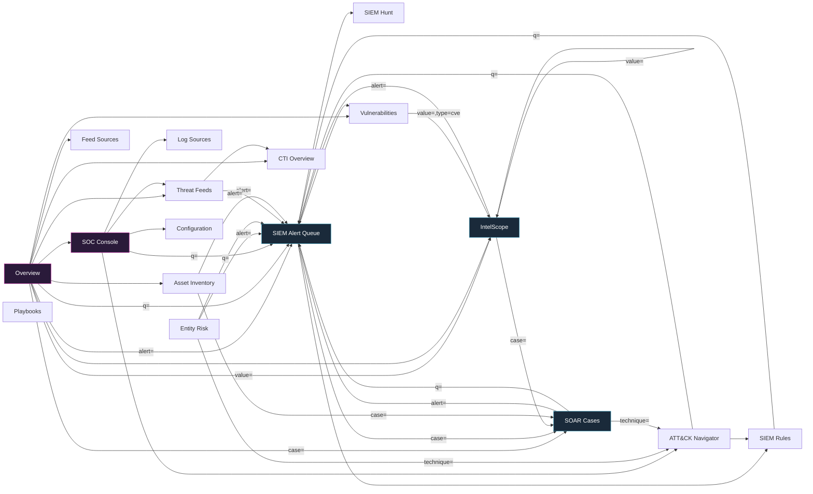

# ThreatOrbit — Dashboard Network Map

> **Purpose.** A complete, ground-truth map of the ThreatOrbit dashboard: every
> page, every feature, every interactive control, every data source, and every
> connection between them — with an honest **status** for each. This is the
> reference we fix against. It is built by reading the source, not by guessing.
>
> If a control is here, it is because it exists in the code. If it is marked
> broken, a line/file reference says where. If a feature *should* exist but
> doesn't, it is listed under **Gaps**.

**Last built from commit:** `574b240` (session baseline). Update the per-page
"verified" line when a section is re-checked against newer code.

---

## How to read this

Each page is documented with a fixed template so nothing is skipped:

- **Route / file / nav** — the URL, the source file, where it sits in navigation.
- **Purpose** — one line: what an analyst uses it for.
- **Data sources** — the exact backend endpoints it reads/writes (via `frontend/lib/api.ts`).
- **Layout & features** — every visible section, in render order.
- **Controls & actions** — *every* button, link, toggle, input, drag target, and
  what it does + where it goes. This is the "tiniest detail" layer.
- **Connections** — deep-links **in** (who sends context here) and **out** (where
  this page sends the analyst), plus external references.
- **Status** — per control, using the legend below.
- **Gaps / bugs** — anything dead, fabricated, frozen, or missing-but-expected.

### Status legend

| Symbol | Meaning |
|---|---|
| ✅ | **Real & wired** — backed by a live endpoint or a working navigation; verified. |
| 🟢 | **Real, static-by-design** — hardcoded but legitimately so (reference data, e.g. MITRE tactic names, CVE seed catalogue). Not a bug. |
| ⚠️ | **Partial / suspect** — works but has a caveat (optimistic-only, demo fallback shown too readily, label mismatch), or not yet re-verified. |
| ❌ | **Dead / fabricated** — button with no handler, control that persists nothing, or hardcoded data shown as if live. **These are bugs.** |
| 🚫 | **Missing** — a feature the nav/product implies should exist here but doesn't. |

### Data-honesty contract (applies everywhere)

1. `frontend/lib/api.ts` `api()` wraps every call and runs `toCamel()` — backend
   returns `snake_case`, the UI reads `camelCase`. (This bit us before: a field
   that isn't transformed reads `undefined` and silently renders blank.)
2. Live data is authoritative **even when empty** — an empty deployment must show
   an honest empty state, never a demo array. Demo/seed constants are labelled
   "offline-only fallback" and should render **only** when the API is unreachable.
3. Any place that shows seed/demo data *as if* it were live is a ❌ (fabrication),
   which is the specific class of bug this project keeps hunting.

---

## 0. Global architecture

### 0.1 Route table (27 routes)

| # | Route | File | Nav location | Feature-gate id |
|---|---|---|---|---|
| 1 | `/dashboard` | `app/dashboard/page.tsx` | (top) Overview | `overview` |
| 2 | `/dashboard/soc` | `app/dashboard/soc/page.tsx` | (top) SOC Console | `soc` |
| 3 | `/dashboard/feeds` | `app/dashboard/feeds/page.tsx` | Intelligence › Threat Feeds › Live Feed | `feeds` |
| 4 | `/dashboard/feeds/sources` | `.../feeds/sources/page.tsx` | Intelligence › Threat Feeds › Sources | `feeds` |
| 5 | `/dashboard/feeds/import` | `.../feeds/import/page.tsx` | Intelligence › Threat Feeds › Import IOCs | `feeds` |
| 6 | `/dashboard/scanner` | `.../scanner/page.tsx` | Intelligence › IntelScope | `scanner` |
| 7 | `/dashboard/cti` | `.../cti/page.tsx` | Intelligence › CTI › Overview | `cti.overview` |
| 8 | `/dashboard/cti/hunt` | `.../cti/hunt/page.tsx` | Intelligence › CTI › Threat Hunt | `cti.hunt` |
| 9 | `/dashboard/cti/actors` | `.../cti/actors/page.tsx` | Intelligence › CTI › Actor Profiles | `cti.actors` |
| 10 | `/dashboard/darkweb` | `.../darkweb/page.tsx` | Intelligence › Dark Web | `darkweb` |
| 11 | `/dashboard/assets` | `.../assets/page.tsx` | Operations › Asset Surface › Inventory | `assets.inventory` |
| 12 | `/dashboard/assets/vulns` | `.../assets/vulns/page.tsx` | Operations › Asset Surface › Vulnerabilities | `assets.vulns` |
| 13 | `/dashboard/assets/network` | `.../assets/network/page.tsx` | Operations › Asset Surface › Network Map | `assets.network` |
| 14 | `/dashboard/siem` | `.../siem/page.tsx` | Operations › SIEM › Alert Queue | `siem.alerts` |
| 15 | `/dashboard/siem/rules` | `.../siem/rules/page.tsx` | Operations › SIEM › Rules Engine | `siem.rules` |
| 16 | `/dashboard/siem/attack` | `.../siem/attack/page.tsx` | Operations › SIEM › ATT&CK Navigator | `siem.attack` |
| 17 | `/dashboard/siem/entities` | `.../siem/entities/page.tsx` | Operations › SIEM › Entity Risk | `siem.entities` |
| 18 | `/dashboard/siem/sources` | `.../siem/sources/page.tsx` | Operations › SIEM › Log Sources | `siem.sources` |
| 19 | `/dashboard/siem/hunt` | `.../siem/hunt/page.tsx` | Operations › SIEM › Threat Hunt | `siem.hunt` |
| 20 | `/dashboard/soar` | `.../soar/page.tsx` | Operations › SOAR › Cases | `soar.cases` |
| 21 | `/dashboard/soar/playbooks` | `.../soar/playbooks/page.tsx` | Operations › SOAR › Playbooks | `soar.playbooks` |
| 22 | `/dashboard/soar/integrations` | `.../soar/integrations/page.tsx` | Operations › SOAR › Integrations | `soar.integrations` |
| 23 | `/dashboard/soar/metrics` | `.../soar/metrics/page.tsx` | Operations › SOAR › SOC Metrics | `soar.metrics` |
| 24 | `/dashboard/config` | `.../config/page.tsx` | System › Configuration › General | `config` |
| 25 | `/dashboard/config/sources` | `.../config/sources/page.tsx` | System › Configuration › Data Sources | `connectors` |
| 26 | `/dashboard/config/users` | `.../config/users/page.tsx` | System › Configuration › Users & Roles | `config` |
| 27 | `/dashboard/config/api` | `.../config/api/page.tsx` | System › Configuration › API Keys | `config` |

### 0.2 Persistent chrome (present on every route)

Mounted by `app/dashboard/layout.tsx`:

- **Sidebar** (`components/dashboard/Sidebar.tsx`) — the nav tree above. Collapses
  to an icon rail; hover/pin to expand. **Live alert badge** at the bottom shows
  `new + investigating` alert count from `fetchSiemAlerts` → links to `/dashboard/siem`. ✅
  Simple-mode hides items not in the org's feature set (`useOrgFeatures`), fail-open. ✅
- **TopBar** (`components/dashboard/TopBar.tsx`) — search trigger, mode toggle,
  user menu. *(section to be detailed)*
- **CommandPalette** (`components/dashboard/CommandPalette.tsx`) — ⌘K global search/nav. *(to be detailed)*
- **AssistantWidget** (`components/dashboard/AssistantWidget.tsx`) — AI assistant. *(to be detailed)*
- **DetailDrawer** (`components/dashboard/DetailDrawer.tsx`) — global right-hand
  detail overlay opened by `openDetail({...})` from any page. Renders rows, tags,
  body, and **actions** (internal `<Link>` or, since this session, external
  `<a target=_blank>` when `external:true`). ✅

### 0.3 Shared feature components (reused across pages)

| Component | Used by | What it is | Status |
|---|---|---|---|
| `ConnectorsPanel` | feeds/sources | Real TI connector CRUD: add/sync/pause/**edit**/delete, honest status | ✅ |
| `PlaybookRunsPanel` | soar/playbooks | Live run history + per-step audit + **approve/reject** | ✅ |
| `IngestionEnginePanel` | feeds/sources | Live engine tick status | ✅ (to verify) |
| `PlaybookBuilder` | soar/playbooks | Visual step builder (create/edit/revert) | ✅ (to verify) |
| `RuleEditor` | siem/rules | Create/edit detection rule + test | ✅ (to verify) |
| `SuppressionsPanel` | siem/rules | Manage suppressions | ✅ (to verify) |
| `EventSearchPanel` | siem/hunt | Raw event search | ✅ (to verify) |
| `LogCollectorPanel` / `LogAnalysisPanel` | siem/sources | Collector config / log analysis | ⚠️ (to verify) |
| `AttackSurfacePanel` | assets | Attack-surface summary | ⚠️ (to verify) |
| `EntityGraph` | cti | Relationship graph | ⚠️ (to verify) |
| `IntelReportsPanel` / `IocLifecyclePanel` | cti | Intel reports / IOC lifecycle | ⚠️ (to verify) |
| `WorldMap` | overview | Live threat geo map | ✅ (to verify) |
| `CreateModal` | feeds/sources, cti, siem/sources, soar/integrations, config/sources | Generic create form | ✅ |
| `ReportButton` | overview, siem, soar, cti, darkweb, assets | Export/report | ⚠️ (to verify) |
| `SavedViewsButton` | siem, feeds, darkweb, assets | Save/restore filters | ⚠️ (to verify) |
| `SigmaImportButton` / `StarterPackButton` | siem/rules | Sigma import / starter rules | ✅ (to verify) |
| `ReportButton`, `AnimatedNumber`, `Skeleton` | many | Presentational helpers | 🟢 |

### 0.4 Connection graph (page-to-page deep-links)

Solid arrow = a control on the source page navigates to the target **with context**
(a `?param=` deep-link). This is the "every action lands on the specific record"
contract.



External references (open in new tab): NVD (`nvd.nist.gov/vuln/detail/<cve>`) from
vulns + feeds; MITRE ATT&CK (`attack.mitre.org`) from ATT&CK Navigator, CTI, cti/hunt.

---

## 1. Overview  ·  `/dashboard`

**File:** `app/dashboard/page.tsx` · **Nav:** top-level · **Verified:** this session (#84).

**Purpose.** The SOC's front door: live KPIs, threat geography, recent alerts/incidents,
top actors, attack vectors, and jump-off tiles to every module.

**Data sources.** `fetchKpis`, `fetchSiemKpis`, `fetchSiemTrends`, `fetchSoarMetrics`,
`fetchRecentAlerts`, `fetchRecentIncidents`, `fetchTopActors`, `fetchVectors`,
`fetchHeatmap`, `fetchHourly`, `fetchRiskDistribution`, `fetchServicesStatus`,
`fetchLiveFeed`, `fetchFleetVulnFindings`. All live.

**Layout & features (render order).**
1. KPI row — live alert/incident/case counters (`fetchKpis`/`fetchSiemKpis`). ✅
2. `WorldMap` — geo threat plot from live feed. ✅
3. Recent alerts list → each row deep-links `/dashboard/siem?alert=<id>`. ✅
4. Recent incidents → `/dashboard/soar?case=<id>`. ✅
5. Top actors, attack vectors, risk distribution, hourly/heatmap charts. ✅
6. Services/health status (`fetchServicesStatus`). ✅
7. Module jump tiles → feeds, cti, vulns, scanner, soc, asset, feed-sources. ✅

**Connections.**
- **Out:** `siem?alert=`, `soar?case=`, `siem?q=`, `scanner?value=`, plus plain
  links to feeds/cti/vulns/scanner/soc/assets/feed-sources.
- **In:** the default landing after login; sidebar "Overview".

**Status.** Card KPIs and every tile navigate to real records (fixed in #84). ✅

**Gaps / bugs.** None open. (Historically had fabricated KPIs; corrected.)

---

## 2. SOC Console  ·  `/dashboard/soc`

**File:** `app/dashboard/soc/page.tsx` · **Nav:** top-level · **Verified:** this session (#87).

**Purpose.** A single triage pane: what needs attention right now (triage queue,
engine health, feed freshness, coverage) with one-click pivots.

**Data sources.** `fetchTriage`, `fetchSiemKpis`, `fetchEngineStatus`,
`fetchFeedsSummary`, `fetchLogListeners`, `fetchAttackCoverage`. All live.

**Layout & features.**
1. Triage queue (`fetchTriage`) — prioritised alerts needing action. ✅
2. Engine status / log listeners (`fetchEngineStatus`, `fetchLogListeners`). ✅
3. Feed freshness (`fetchFeedsSummary`). ✅
4. ATT&CK coverage summary (`fetchAttackCoverage`). ✅

**Connections.**
- **Out:** `siem?q=`, plus links to `siem/attack`, `siem/sources`, `feeds`, `config`, `siem`.
- **In:** sidebar "SOC Console"; overview tile.

**Status.** Populated from live posture (verified #87). ✅

**Gaps / bugs.** None open.

---

## 3. Threat Feeds — Live Feed  ·  `/dashboard/feeds`

**File:** `app/dashboard/feeds/page.tsx` · **Nav:** Intelligence › Threat Feeds › Live Feed.

**Purpose.** The rolling stream of incoming threat-intel events (IOCs, CVEs,
campaigns) as they arrive from connectors.

**Data sources.** `fetchFeeds`, `fetchFeedsSummary`, `fetchIocs`, `importIocs`,
`createAlert`. Live. **Note:** the page also carries a hardcoded demo array of
threat cards (`c001…`, CVE-2024-6387 etc.) — needs confirming these are
fallback-only and not shown alongside live data.  ⚠️ *(verify)*

**Controls & actions.**
- CVE badge on each card → **`https://nvd.nist.gov/vuln/detail/<cve>`** (new tab). ✅ (fixed #90)
- Card → opens detail; IOCs pivot to `/dashboard/siem?alert=` and `/dashboard/cti`. ✅
- Import / create-alert actions. ✅ *(verify wiring)*
- `SavedViewsButton`, `AnimatedNumber`, `Skeleton`. ⚠️/🟢

**Connections.** Out: `siem?alert=`, `cti`, NVD, `attack.mitre.org`. In: overview tile.

**Status.** CVE→NVD links fixed this session. Core stream is live.

**Gaps / bugs.**
- ⚠️ **Confirm** the hardcoded threat-card array (`c001…`) is an offline fallback
  only, never rendered beside live feed data. If it renders in demo/live, it is a
  fabrication ❌. *(open — needs a read of the render branch)*

---

## 4. Threat Feeds — Sources  ·  `/dashboard/feeds/sources`

**File:** `app/dashboard/feeds/sources/page.tsx` · **Verified:** this session (#89).

**Purpose.** Manage upstream feed providers + the real connector control surface.

**Data sources.** `fetchFeeds`, `fetchFeedsSummary`, `createFeed`, `toggleFeed`.
Embeds **`ConnectorsPanel`** (real connector CRUD) + **`IngestionEnginePanel`**.

**Controls & actions.**
- KPI strip: Active Feeds, IOCs Today (real `newToday`), Total Indicators, Errored. ✅
- `ConnectorsPanel`: Add / Sync now / Pause / **Edit-reconfigure** / Delete, honest
  live status + last-error. ✅ (edit added #89)
- Feed table: enable/disable toggle per row (`toggleFeed`). ✅
- Feed **detail panel**: real fields (provider, live status, indicators, interval,
  last pull) + working enable/disable; note that pulls/keys live on the connector. ✅
  (Removed the old dead Configure/Pull-Now/Test-Connection buttons + fake confidence
  slider + invented API-key/TAXII/tag rows this session — #89.)
- Add Feed modal (`CreateModal` → `createFeed`). ✅

**Connections.** In: overview, feeds. Out: (points to ConnectorsPanel above for pulls).

**Status.** ✅ across the board after #89.

**Gaps / bugs.** None open. (Backend feed PATCH only toggles enabled — reconfigure
is a connector concern, and the UI now says so honestly.)

---

## 5. Threat Feeds — Import IOCs  ·  `/dashboard/feeds/import`

**File:** `app/dashboard/feeds/import/page.tsx`.

**Purpose.** Bulk-import indicators (paste / file / format-mapped) into the CTI store.

**Data sources.** `importIocs`, `fetchImportHistory`. Live.

**Controls & actions.** *(to be detailed — read pending)* import form, format
select, submit → `importIocs`; import-history table from `fetchImportHistory`.

**Status.** ⚠️ Not yet re-verified this pass.

**Gaps / bugs.** *(pending read)*

---

## 6. IntelScope (Scanner)  ·  `/dashboard/scanner`

**File:** `app/dashboard/scanner/page.tsx` · **Verified:** this session (#80/#85/#86).

**Purpose.** Look up any indicator (IP/URL/hash/file, and CVE via hand-off) against
the live TI store + enrichment providers + relations, with honest provenance.

**Data sources.** `lookupIoc` (`/cti/lookup`), `fetchScanEnrich` (`/cti/scan/enrich`),
`fetchScanContext` (`/cti/scan/context`), `fetchEnrichers`, `fetchScans`, `recordScan`,
`importIocs`. Live. Degrades to a clearly-labelled demo block only when the API is
unreachable.

**Controls & actions.**
- Type tabs (URL / IP / Hash / File) + query input + Scan button. ✅
- **Deep-link auto-run:** `?value=&type=&run=1` pre-fills and auto-scans. ✅ (#86)
- Result tabs: Details / Relations / Community / Sources. ✅
- **Provenance badge** classifies source: Engine-derived / NVD / Analyst-import /
  External feed (hover explains). ✅ (#85)
- Relations pivot to `/dashboard/siem?alert=` and `/dashboard/soar?case=`. ✅
- File scan: in-browser SHA-256, nothing uploaded. ✅

**Connections.** In: `scanner?value=` from overview, vulns (`type=cve`), feeds, CTI.
Out: `siem?alert=`, `soar?case=`, self (`scanner?value=` pivots), `example.com` (placeholder text only).

**Status.** ✅ Hardened for honesty + hand-off this session.

**Gaps / bugs.** None open.

---

## 25. Configuration — Data Sources  ·  `/dashboard/config/sources`

**File:** `app/dashboard/config/sources/page.tsx` · **Nav:** System › Configuration › Data Sources · **Verified:** this session (source read).

**Purpose.** Connect enterprise log sources (Cloud / Identity / Endpoint / Network /
SaaS vendors) so their telemetry flows into the SIEM; add custom sources.

**Data sources.** `fetchSiemSources`, `createLogSource`, `fetchSettings`, `updateSettings`.

**Layout & features.**
1. Built-in connector catalogue — 15 vendor cards (`CONNECTORS`, lines 47–68),
   grouped by category, each with a status badge + data-type chips.
2. Custom-source types (Syslog/Webhook/S3/Kafka/Custom) + "Add Connector". ✅
3. Per-connector **ConfigPanel** (endpoint / auth / interval / field-mapping) →
   `updateSettings` persists config; first connect also `createLogSource`. ✅

**Controls & actions.**
- Connector card status badge — "Connected" (pulsing green) / "Not configured". **See bug.**
- Configure / Connect button → opens ConfigPanel. ✅
- ConfigPanel Save/Connect → `updateSettings(connector_<id>)` + `createLogSource`. ✅
- Add Connector modal → persists to `custom_connectors` setting + `createLogSource`. ✅
- Field-mapping inputs in ConfigPanel are `defaultValue`-only — **not persisted**
  (the mapping rows at lines 205–222 collect nothing on save). ⚠️

**Status.** Config persistence and custom-connector creation are ✅. The **status
badge is conditionally fabricated** — see below.

**Gaps / bugs.**
- ❌ **CONFIRMED — fabricated "Connected" on an empty deployment.** State inits from
  the hardcoded catalogue where AWS, Azure, Okta, Azure AD, CrowdStrike, SentinelOne,
  Palo Alto, Fortinet, Microsoft 365, Slack all have `status:'connected'`
  (`page.tsx:47–68`). A mount effect recomputes status from live log sources
  (`page.tsx:394–412`) **but** guards with `if (sources.length === 0) return`
  (**line 398**). So on a fresh install with no log sources, the recompute bails and
  10 major vendors render as live "Connected" (pulsing green dot). **Fix:** drop the
  early return — with zero live sources every built-in connector must resolve to
  `unconfigured`. One-line change; high priority (this is the exact audit class).
- ⚠️ Hardcoded demo endpoints (`acme.okta.com`, `panorama.acme.com`,
  `fortigate.acme.com`, `acme.sentinelone.net`) pre-fill the ConfigPanel endpoint
  field — reads like a real configured endpoint. Should default to empty/placeholder.
- ⚠️ ConfigPanel field-mapping inputs persist nothing (cosmetic form).

---

## 🔴 SYSTEMIC ROOT CAUSE — "seed-persists-on-empty" (B8)

**This is why "bugs like the audit" keep reappearing.** One wrong data-loading
pattern was copy-pasted across pages. The honest pattern (used by feeds, soar,
scanner, config/api …) is:

```ts
const [rows, setRows] = useState<T[]>([])                 // start EMPTY
useEffect(() => { fetchX().then(setRows).catch(() => setRows(SEED)) }, [])
//   live result (even []) wins → honest empty state; SEED only when API is unreachable
```

The broken pattern (below) shows fabricated seed data on any **empty-but-reachable**
deployment — a freshly provisioned SOC with the API up but nothing ingested yet:

```ts
const [rows, setRows] = useState<T[]>(SEED)               // ❌ starts with fake data
useEffect(() => { fetchX().then(d => { if (d.length > 0) setRows(d) }) ... }, [])
//   empty live result is IGNORED → the fake SEED stays on screen as if real
```

**Affected pages (all show fabricated data on an empty deployment):**

| ID | Page | Seed shown as real | Init | Guard |
|---|---|---|---|---|
| B8a | `siem/rules` | fake detection rules `RULES_DATA` | `page.tsx:770` | `:775,873,875,1167` |
| B8b | `siem/sources` | fake log sources `SOURCES` | `page.tsx:93` | `:98` |
| B8c | `config/users` | fake team users `USERS` | `page.tsx:373` | `:378` |
| B8d | `cti` (Actors) | fake threat actors `ACTORS` (+ `ACTORS[0]` default) | `page.tsx:686-687` | `:698` |
| B1 (variant) | `config/sources` | 10 vendors "Connected" | `page.tsx:324` | recompute early-returns `:398` |
| B7 (variant) | `assets/network` | fake network topology `NODES`/`BASE_LINKS` | `page.tsx:199` | merges, never gates `:242` |

**Uniform fix (one small edit per page):** init state to `[]`; drop the
`if (data.length > 0)` guard so the live result always wins; move the SEED into
`.catch(() => setRows(SEED))` (API-unreachable only). For B1 drop the
`sources.length === 0` early-return; for B7 render the seed topology only in the
`.catch`/offline branch (or drop it and render live assets only).

**Impact:** fixing this one pattern removes fabrication from 6 pages at once. This
is the highest-leverage change on the board.

> ✅ **FIXED** (commit after `2463d8d`). All six now start empty and let the live
> result win: `siem/rules`, `siem/sources`, `config/users` init `[]` + seed only in
> `.catch`; `cti` makes `selectedActor` nullable with an honest empty state;
> `config/sources` drops the `sources.length===0` early-return so connectors
> resolve to `unconfigured` with no live sources; `assets/network` adds a clear
> "illustrative topology" banner so example nodes are never mistaken for real
> assets (full live-only topology render is a follow-up). Verified: tsc clean,
> build clean, all six render real data with zero runtime errors against the live
> demo stack. Remaining dead-button fixes B2–B5 still open.

---

## ⭐ Confirmed bug list (fix targets)

Surfaced by reading source + systematic scans (seed-persists-on-empty;
hardcoded-state; `<button>` without a handler). Fix top-down.

| # | Severity | Page | Bug | Location | Fix |
|---|---|---|---|---|---|
| **B8** | **High (systemic)** | `siem/rules`, `siem/sources`, `config/users`, `cti`/Actors | **seed-persists-on-empty** — fake rules/log-sources/users/actors render as real on any empty-but-reachable deployment (see root-cause section above) | init `useState(SEED)` + `if(data.length>0)` guard | init `[]`; live result always wins; SEED only in `.catch`. **One pattern, 4 pages.** |
| B1 | **High** | `config/sources` | 10 major vendors show live "Connected" (pulsing green) on a fresh deployment — hardcoded status, never re-derived when there are zero log sources (B8 variant) | `config/sources/page.tsx:398` (`if (sources.length===0) return`) | Drop the early return; with no live sources every built-in connector resolves to `unconfigured`. |
| B7 | **High** | `assets/network` | Fake network topology (firewalls/servers/workstations w/ invented IPs like `fw-edge-01`, `203.0.113.1`, `DESKTOP-FIN-087`) renders **unconditionally**; live assets merged on top (B8 variant) | `assets/network/page.tsx:199,242` | Render seed topology only offline; on live, show real assets only (empty state if none). |
| B2 | **High** | `siem/sources` | Dead action row on the source detail: **Configure / Reconnect / Test Parse** buttons have no `onClick` (same class fixed on feeds/sources in #89, missed here) | `siem/sources/page.tsx:283,287,291` | Wire to real endpoints or remove; mirror the honest feeds/sources treatment. |
| B3 | Med | `assets` | Asset row **Details** button is dead (Scan + remove work) | `assets/page.tsx:664` | Open the asset detail drawer (`fetchAsset`/`fetchAssetActivity` already imported). |
| B4 | Low | `config/api` | API-key **View scopes** button is dead | `config/api/page.tsx:411` | Expand/show the key's scopes (data already present in the row). |
| B5 | Low | `siem` | Raw-log **Copy** button is dead (alert detail → Raw tab) | `siem/page.tsx:955` | `navigator.clipboard.writeText(raw)` + toast. |
| B6 | Low | `config/sources` | ConfigPanel field-mapping inputs persist nothing (cosmetic) + demo `acme.*` endpoints pre-fill | `config/sources/page.tsx:205–222,49–67` | Persist the mapping or drop it; default endpoint to empty. |

**Verified honest (do NOT re-flag) —** these use the correct offline-only fallback
pattern (real API primary; hardcoded array only rendered on `.catch`, gated):
- `config/api` — `acme.io` webhook/key rows are fallback (`page.tsx:239,250,254`). ✅
- `feeds` (Live Feed) — seed threat cards + simulator are offline/`demoMode`-only
  with honest empty states (`page.tsx:547–560,813,862`). ✅
- `soar`, `siem`, `scanner`, `soar/playbooks`, `feeds/sources` — all fallback-gated. ✅

**Scan results (dashboard-wide):**
- `<button>` without an inline handler: **7 total** → 6 real dead controls (B2×3, B3,
  B4, B5) + 1 false positive (`WorldMap.tsx:210` is a hover-highlight row). Clean
  overall — the #79 dead-navigation pass held.
- Hardcoded-state-without-fallback-gate: **1** (`config/sources`, B1). Everything
  else follows the honest `.catch` fallback pattern.

---

## 5. Threat Feeds — Import IOCs  ·  `/dashboard/feeds/import`

**File:** `feeds/import/page.tsx` · **Data:** `importIocs`, `fetchImportHistory`.
**Purpose.** Paste or upload raw text; auto-extract IPs/domains/URLs/hashes/CVEs
(regex `RE_URL`/`RE_CVE`/`RE_DOMAIN`, lines 60–62), tag with TLP + confidence, import.
**Controls.** Textarea (defang-aware) → live extraction preview ✅; TLP/confidence
selects 🟢; tag input ✅; Import → `importIocs` ✅; import-history table (`fetchImportHistory`) ✅.
**Status.** ✅ Honest real-import flow. No fabrication.

## 7. CTI — Overview  ·  `/dashboard/cti`

**File:** `cti/page.tsx` · **Data:** `fetchActors`, `fetchCtiSummary`, `fetchCtiHunts`,
`createCtiHunt`, `fetchIocTypes`. Components: `EntityGraph`, `IntelReportsPanel`, `IocLifecyclePanel`.
**Purpose.** Threat-intel command view — top actors, IOC-type breakdown, hunts, intel reports, relationship graph.
**Controls.** Actor cards → actor detail/graph ✅; hunt create (`CreateModal`→`createCtiHunt`) ✅;
IOC-type chips ✅; `EntityGraph` relationship view ⚠️(verify); report/lifecycle panels ⚠️(verify).
**Gaps.** ❌ **B8d** — `useState<Actor[]>(ACTORS)` (`:686`) + `if(data.length>0)` (`:698`):
the fake actor list shows on an empty deployment. `HUNTS`/`IOC_TYPES` are correctly
`.catch`-fallback (`:363,721`, "offline preview only") ✅.

## 8. CTI — Threat Hunt  ·  `/dashboard/cti/hunt`

**File:** `cti/hunt/page.tsx` · **Data:** `fetchCtiHunts`, `runCtiHunt`, `fetchAttackCoverage`.
**Purpose.** Hypothesis-driven hunts across the intel corpus, ATT&CK-tactic framed.
**Controls.** Hunt list + run (`runCtiHunt`) ✅; hypothesis status pills ✅; `MATRIX_TACTICS`
is ATT&CK reference data 🟢; MITRE links → `attack.mitre.org` ✅.
**Gaps.** `HUNTS` seed is `.catch`-fallback only (`:570`, "offline preview only") ✅. Clean.

## 9. CTI — Actor Profiles  ·  `/dashboard/cti/actors`

**File:** `cti/actors/page.tsx` · **Data:** `fetchActors`, `fetchCtiSummary`.
**Purpose.** Browse/search threat actors (aliases, malware, motivation, threat level, TTPs).
**Controls.** Search/filter ✅; actor card → detail ✅; MITRE technique links → `attack.mitre.org` ✅.
**Gaps.** `ACTORS` seed is `.catch`-fallback (`:647`) ✅. **KPI strip is DERIVED** — live from
`fetchCtiSummary`, hardcoded 47/12/23/16 only as fallback (`:654–661`) ✅ (minor ⚠️: values are
keyed by label string, so a summary missing a label falls back to the hardcoded number).

## 10. Dark Web  ·  `/dashboard/darkweb`

**File:** `darkweb/page.tsx` · **Data:** `fetchDarkWebFindings`, `fetchDarkWebSummary`,
`updateDarkWebFinding`, `requestTakedown`.
**Purpose.** Monitor leaked creds / brand abuse / chatter; triage + request takedowns.
**Controls.** Search/filter ✅; finding status update (`updateDarkWebFinding`, optimistic + rollback `:71`) ✅;
**Request takedown** (`requestTakedown`) ✅; `ReportButton`, `SavedViewsButton` ⚠️(verify).
**Status.** ✅ Honest, real-data, actions wired.

## 11. Assets — Inventory  ·  `/dashboard/assets`

**File:** `assets/page.tsx` · **Data:** `fetchAssets`, `fetchAsset`, `createAsset`, `deleteAsset`,
`recomputeAssetRisk`, `scanAssetVulns`, `fetchAssetActivity`. Component: `AttackSurfacePanel`.
**Purpose.** Asset inventory + attack surface; per-asset risk, scan, activity.
**Controls.** Search/filter ✅; **Scan** (`scanAssetVulns`) ✅; **Scan all** ✅; **Remove**
(`deleteAsset`) ✅; add asset (`createAsset`) ✅; rows → `siem?alert=`, `soar?case=` ✅.
**Gaps.** ❌ **B3** — asset row **Details** button (`:664`) has no `onClick` (dead). `SEED` is
correct `.catch`-fallback (`:195`, "used only if the API is unreachable") ✅.

## 12. Assets — Vulnerabilities  ·  `/dashboard/assets/vulns`

**File:** `assets/vulns/page.tsx` · **Data:** `fetchFleetVulnFindings`, `fetchVulnSummary`. **Verified:** #90.
**Purpose.** Fleet CVE findings with CVSS, exploit maturity, KEV, remediation, references.
**Controls.** Filters (sev/status/KEV/exploit) ✅; row → detail drawer ✅; **View on NVD**
(`nvd.nist.gov/vuln/detail/<cve>`, new tab) ✅ (#90); **Look up in IntelScope**
(`scanner?value=<cve>&type=cve&run=1`) ✅ (#86,#90); clickable NVD references ✅.
**Status.** ✅ Seed CVE catalogue is legitimate reference data 🟢; findings are live. Clean.

## 13. Assets — Network Map  ·  `/dashboard/assets/network`

**File:** `assets/network/page.tsx` · **Data:** `fetchAssets`.
**Purpose.** Zone topology (DMZ/Internal/Cloud/OT) with hosts, ports, risk, attack-path trace.
**Controls.** Zoom/pan SVG ✅; node drag ✅; zone toggle ✅; node select → detail ✅; trace-path toggle ✅.
**Gaps.** ❌ **B7 (High)** — `useState<Node[]>(NODES)` (`:199`) renders a hardcoded fake corporate
topology (firewalls/servers/workstations, invented IPs) **unconditionally**; live assets are
merged on top (`:217,242`); `.catch` does nothing (`:245`). On a real deployment an analyst sees
fabricated infrastructure. Fix: seed topology offline-only; live → real assets only.

## 14. SIEM — Alert Queue  ·  `/dashboard/siem`

**File:** `siem/page.tsx` · **Data:** `fetchSiemAlerts`, `fetchSiemKpis`, `fetchSiemTrends`,
`fetchCorrelations`, `fetchMitreDistribution`, `patchAlert`, `updateAlert`, `createCase`,
`createSuppression`, `fetchAlertFpAssessment`, `fetchFpTriage`, `bulkDismissAlerts`,
`fetchEntityDetail`, `fetchPlaybooks`, `runPlaybook`. **Verified:** this session (#92).
**Purpose.** The core triage surface: alert queue, detail, FP triage, correlations, MITRE dist.
**Controls (alert detail).** Assign / Escalate / Create Case (`createCase`→`soar?case=`) /
Suppress (`createSuppression`) / Run Playbook (`runPlaybook`) ✅; Status + Disposition selects
(`updateAlert`) ✅; **one-click Undo** on all four via toast ✅ (#92); FP assessment ✅;
`?alert=<id>` + `?q=` deep-link handlers ✅; links → `siem/hunt`, `siem/rules`, `assets/vulns`.
**Gaps.** ❌ **B5 (Low)** — Raw-log **Copy** button (`:955`) has no `onClick` (dead).
Seed `ALERTS` array is `.catch`-fallback ✅.

## 15. SIEM — Rules Engine  ·  `/dashboard/siem/rules`

**File:** `siem/rules/page.tsx` · **Data:** `fetchRules`, `patchRule`, `deleteRule`. Components:
`RuleEditor`, `SuppressionsPanel`, `SigmaImportButton`, `StarterPackButton`. **Verified:** #93.
**Purpose.** View/create/edit/test/enable/delete detection rules; suppressions; Sigma import.
**Controls.** Rule row → detail/edit (`RuleEditor`, create+backtest, `:486,497`) ✅; enable toggle
(`patchRule`, `:804`) ✅; delete (`deleteRule`) ✅; Sigma import ✅; starter pack ✅;
suppressions panel ✅; row → `siem?q=` ✅.
**Gaps.** ❌ **B8a (High)** — `useState(RULES_DATA)` (`:770`) + `if(data.length>0)` guards
(`:775,873,875,1167`): fake rules show on an empty deployment.

## 16. SIEM — ATT&CK Navigator  ·  `/dashboard/siem/attack`

**File:** `siem/attack/page.tsx` · **Data:** `fetchAttackCoverage`. **Verified:** #94.
**Purpose.** Detection coverage by MITRE technique; gaps; per-technique drill-down.
**Controls.** Technique cell → drawer ✅; **`?technique=<id>` inbound deep-link** opens the cell (#94) ✅;
View matching alerts (`siem?q=`) ✅; Review/Author rules (`siem/rules`) ✅; MITRE reference (external) ✅.
**Status.** ✅ Fully wired. Coverage from live rules+alerts.

## 17. SIEM — Entity Risk (UEBA)  ·  `/dashboard/siem/entities`

**File:** `siem/entities/page.tsx` · **Data:** `fetchEntities`, `fetchEntityDetail`. **Verified:** #94.
**Purpose.** Users/hosts/IPs ranked by behavioural risk; timeline, baseline, techniques, alerts.
**Controls.** Type filter ✅; entity → detail drawer ✅; **top techniques → `siem/attack?technique=`** (#94) ✅;
**contributing alerts → `siem?alert=`** (#94) ✅; View all in SIEM (`siem?q=`) ✅.
**Status.** ✅ Every drill-down lands on a real record.

## 18. SIEM — Log Sources  ·  `/dashboard/siem/sources`

**File:** `siem/sources/page.tsx` · **Data:** `fetchSiemSources`, `createLogSource`. Components:
`LogCollectorPanel`, `LogAnalysisPanel`.
**Purpose.** Registered log sources, EPS/health, collector config, log analysis.
**Controls.** Source row → detail ✅; add source (`CreateModal`→`createLogSource`) ✅;
collector/analysis panels ⚠️(verify).
**Gaps.** ❌ **B2 (High)** — source-detail **Configure / Reconnect / Test Parse** buttons
(`:283,287,291`) have no `onClick` (dead action row — same class fixed on feeds/sources #89).
❌ **B8b (High)** — `useState(SOURCES)` (`:93`) + `if(data.length>0)` (`:98`): fake sources on empty deployment.

## 19. SIEM — Threat Hunt  ·  `/dashboard/siem/hunt`

**File:** `siem/hunt/page.tsx` · **Data:** `fetchSiemHunts`, `createSiemHunt`, `runHuntQuery`.
Component: `EventSearchPanel`.
**Purpose.** Query-based hunting over the raw event stream; save hunts; export results.
**Controls.** Query editor (⌘/Ctrl+Enter runs, `:313`) → `runHuntQuery` ✅; time-range select ✅;
save hunt (`createSiemHunt`, `:340`) ✅; **Export results** (client-side CSV, `:189`) ✅;
`EventSearchPanel` ✅; saved-hunt list ✅.
**Gaps.** `SAVED_HUNTS` is `.catch`-fallback (`:262`) ✅; `DEFAULT_QUERY` is a default string 🟢. Clean.

## 20. SOAR — Cases  ·  `/dashboard/soar`

**File:** `soar/page.tsx` · **Data:** `fetchCases`, `fetchCaseRelated`, `fetchSoarMetrics`,
`createCase`, `addCaseNote`, `patchCaseTask`, `runPlaybook`, `addCaseEvidence`, `exportEvidenceBundle`.
**Verified:** #91.
**Purpose.** Case management: queue, detail (overview/warroom/tasks/evidence), investigation viz.
**Controls.** Case → detail ✅; `?case=<id>` deep-link ✅; task advance (`patchCaseTask`) ✅;
war-room note (`addCaseNote`) ✅; **Attack timeline** + **Affected systems** from `/related` (#91) ✅;
technique badges → `siem/attack?technique=` ✅; linked alerts → `siem?alert=` ✅; evidence export ✅.
**Gaps.** `CASES` seed is `.catch`-fallback (`:986`) ✅. Clean.

## 21. SOAR — Playbooks  ·  `/dashboard/soar/playbooks`

**File:** `soar/playbooks/page.tsx` · **Data:** `fetchPlaybooks`, `runPlaybook`, `updatePlaybook`.
Components: `PlaybookBuilder`, `PlaybookRunsPanel`. **Verified:** #95.
**Purpose.** Playbook library, run, enable/disable (auto-trigger), visual builder, run history, approvals.
**Controls.** Run (`runPlaybook`) ✅; enable toggle (`updatePlaybook`) ✅; builder create/edit/revert ✅;
in-place refetch after save (#95) ✅; `PlaybookRunsPanel`: run history + per-step audit + **approve/reject** ✅.
**Gaps.** `PLAYBOOKS` seed is `.catch`-fallback (`:986` equiv) ✅. Clean.

## 22. SOAR — Integrations  ·  `/dashboard/soar/integrations`

**File:** `soar/integrations/page.tsx` · **Data:** `fetchSoarIntegrations`, `createIntegration`,
`testIntegration`, `runIntegrationAction`, `updateIntegration`.
**Purpose.** Third-party SOAR integrations (ticketing/chat/EDR): credentials, enable, run actions.
**Controls.** Add (`createIntegration`) ✅; credential save (`updateIntegration`, `:92`) ✅;
enable toggle (optimistic+rollback, `:310`) ✅; **Test** (`testIntegration`) ✅; **Run action**
(`runIntegrationAction`, `:191`) ✅. `api.vendor.example` is an input **placeholder** only ✅.
**Status.** ✅ Honest, real CRUD + actions.

## 23. SOAR — SOC Metrics  ·  `/dashboard/soar/metrics`

**File:** `soar/metrics/page.tsx` · **Data:** `fetchSoarMetrics`, `fetchSoarAnalysts`,
`fetchAlertAnalytics`, `fetchSiemKpis`, `fetchAttackCoverage`, `fetchPlaybooks`. **Verified:** #59,#61.
**Purpose.** SOC performance: MTTR/MTTD, cases-by-type, analyst leaderboard, coverage, trends.
**Controls.** Read-only analytics dashboard; all cards live (hardcoded "Cases by Type" and 7-day
trends were replaced with real endpoints in #59/#61) ✅.
**Status.** ✅ Clean.

## 24. Configuration — General  ·  `/dashboard/config`

**File:** `config/page.tsx` (large; tabbed) · **Data:** `fetchSettings`/`updateSettings`, `fetchAbout`,
`fetchSelfHealth`, `fetchEngineStatus`, `fetchDatabaseInfo`, `fetchJobs`, `fetchLicense`,
`fetchBillingStatus`+`startCheckout`+`openBillingPortal`, `fetchMfaStatus`+`mfaEnroll/Verify/Disable`,
`fetchSessions`+`revokeSession`, `fetchAuditLog`, `fetchMySlackRouting`, `fetchCurrentOrg`, `fetchSoarIntegrations`, `fetchFeeds`.
**Purpose.** Deployment settings hub: Experience Mode, Appearance, MFA, Sessions, Billing, About,
Self-Health, **Activity/Audit log**, Slack routing, engine/DB status.
**Controls.** Settings toggles (`updateSettings`, `FloatingSave`) ✅; **MFA** enroll/verify/disable ✅;
**Sessions** list + **revoke** (`:1095`) + revoke-others ✅; **Billing** Stripe checkout/portal with
honest "not configured" fallback (`:1331`) ✅; Self-Health surface ✅; Audit/Activity log
(`fetchAuditLog`) ✅ — *this is the "action history" surface referenced by #92*.
**Status.** ✅ Real throughout. Seed constants are `.catch`-fallbacks.

## 26. Configuration — Users & Roles  ·  `/dashboard/config/users`

**File:** `config/users/page.tsx` · **Data:** `fetchUsers`, `createUser`, `patchUser`, `deleteUser`,
`fetchAuditLog`.
**Purpose.** Team management: invite/create users, change roles, deactivate; per-user activity log.
**Controls.** Create user (`createUser`) ✅; role change (`patchUser`, optimistic+rollback `:388`) ✅;
delete (`deleteUser`) ✅; per-user **Activity Log** (`fetchAuditLog`, `:317`) ✅.
**Gaps.** ⚠️ **B8c** — `useState<TeamUser[]>(USERS)` (`:373`) + `if(data.length>0)` (`:378`): fake
users show on an empty result. (Lower real-world risk — the users endpoint is rarely empty since
the admin always exists — but same pattern; fix with the B8 change.)

## 27. Configuration — API Keys  ·  `/dashboard/config/api`

**File:** `config/api/page.tsx` · **Data:** `fetchApiKeys`+`createApiKey`+`revokeApiKey`,
`fetchWebhooks`+`createWebhook`+`patchWebhook`+`deleteWebhook`+`testWebhook`+`rotateWebhookSecret`.
**Purpose.** Programmatic access: API keys (scopes, usage) + outbound webhooks (events, delivery).
**Controls.** Create key (`createApiKey`, one-time reveal) ✅; revoke ✅; create/edit/delete webhook ✅;
**Test webhook** ✅; **Rotate secret** ✅; cURL snippet 🟢.
**Gaps.** ❌ **B4 (Low)** — API-key **View scopes** button (`:411`) has no `onClick` (dead). The
`API_KEYS`/`WEBHOOKS` (`acme.io`) arrays are correct `.catch`-fallbacks (`:239,250,254`) ✅.

---

## Appendix A — Persistent chrome detail *(pending read)*

`TopBar`, `CommandPalette` (⌘K), `AssistantWidget` — to be documented with the same
template. Structural note: these are shared across all routes (mounted in `layout.tsx`).

## Appendix B — Backend API surface

Every `fetchX`/`createX`/… in `frontend/lib/api.ts` maps to a FastAPI route under
`dashboard_api/routers/` (`overview`, `siem`, `soar`, `cti`, `feeds`, `connectors`,
`assets`, `config`, `platform`, `auth`). All responses pass through `toCamel()`.
Multi-tenant scoping (`tenancy.scope_sql`) is enforced server-side regardless of UI.
